# Sistema de Gerenciamento de Atendimentos para Clínica Oftalmológica com Java + Quarkus

Este projeto é um sistema web desenvolvido para gerenciar o atendimento de uma clínica oftalmológica. 
O sistema permite o controle de senhas, cadastro de pacientes em filas, chamadas para atendimento médico, e gerenciamento 
de usuários com diferentes perfis.

## 🏥 Funcionalidades

- **Retirada de Senha**
    - Geração de senhas do tipo **Geral (G)** e **Preferencial (P)** no formato `G001`, `P002`, etc.
- **Chamada de Senhas**
    - Atendentes podem chamar a próxima senha disponível conforme a fila.
- **Cadastro de Paciente**
    - Após a chamada da senha, o atendente cadastra o paciente com nome e CPF.
- **Fila Médica (Em memória)**
    - Pacientes cadastrados são adicionados a uma fila específica para atendimento médico.
- **Atendimento Médico**
    - Médicos visualizam e chamam o próximo paciente da fila pelo nome, sem uso de senhas.
- **Controle de Usuários**
    - Acesso baseado em perfis: `admin`, `atendente`, `medico`.
    - Há uma interface para gerenciamento dos perfis dos usuários pelo admin e o proprio usuário pode alterar o próprio 
  perfil.
    - Perfis de `admin` tem permissão total, sendo exclusivo desse perfil as permissões para realizar buscar, editar, criar 
  e deletar usuarios pela interface de `Usuário` do Menu.
    - Perfis de `atendente` podem realizar atendimentos por meio da tela do Menu -> Atendimento

## 🔧 Tecnologias Utilizadas

- **Back-end:** Quarkus (Java)
- **Front-end:** HTML, CSS, JavaScript (Qute para templates)
- **Banco de Dados:** PostgresSQL
- **Controle de Acesso:** Baseado no perfil do usuário
- **Gerenciamento de estado:** Filas mantidas em memória (para chamadas de atendimento)

## Requisitos do Projeto

Certifique-se de que o seguinte item estejam instalado em sua máquina antes de executar o projeto:

* SDK: Java 18
1. No menu superior, acesse: File → Project Structure
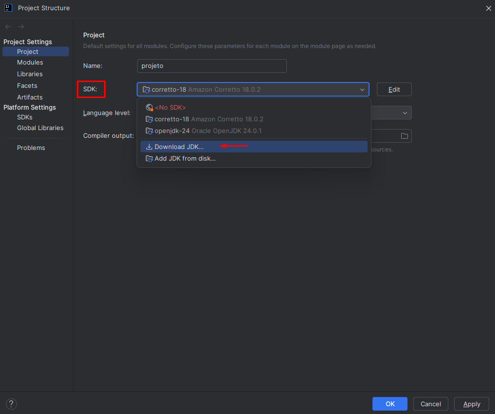

2. Em seguida, selecione a versão 18 do Java na opção de SDK:


   💡 Importante: O projeto foi desenvolvido com Java 18. Usar versões diferentes pode gerar erros de compatibilidade, 
especialmente com bibliotecas ou configurações do Quarkus.

## 📁 Estrutura do Projeto
```
└── main
├── java
│ └── br
│ └── edu
│ └── ifg
│ └── luziania
│ ├── controller # Controladores REST e navegação
│ │ ├── GerenciamentoDeSenhas
│ │ │ ├── AtendenteController
│ │ │ ├── CadastroPacienteController
│ │ │ └── RetirarSenhaController
│ │ ├── AgendamentoController
│ │ ├── HomeController
│ │ ├── LoginController
│ │ ├── MedicoController
│ │ ├── SiteAdminController
│ │ └── UsuarioController
│ ├── model
│ │ ├── bo # Camada de regras de negócio
│ │ │ ├── GerenciamentoDeSenhas
│ │ │ │ ├── AtendimentoBO
│ │ │ │ └── SenhaBO
│ │ │ └── UsuarioBO
│ │ ├── dao # Acesso a dados
│ │ ├── dto # Objetos de transferência de dados
│ │ ├── entity # Entidades JPA
│ │ ├── exception # Exceções personalizadas
│ │ ├── jwt # Utilitários para tokens JWT
│ │ ├── log # Funcionalidades de log
│ │ └── security
│ │ └── jwt # Configuração de segurança com JWT
├── resources
│ ├── META-INF
│ │ └── resources
│ │ ├── css # Arquivos de estilo
│ │ ├── img # Imagens utilizadas no sistema
│ │ │ ├── editar.png
│ │ │ └── lixeira.png
│ │ └── img_readme # Imagens utilizadas no README
│ ├── js
│ │ ├── gerenciamentoDeSenhas
│ │ │ ├── atendente.js
│ │ │ ├── cadastroPaciente.js
│ │ │ └── retirarSenha.js
│ │ └── agendarConsulta.js
│ └── templates # Templates HTML (Qute)
│ └── application.properties # Configurações do Quarkus
```
## 🚀 Como Executar o Projeto

### 1. Baixar o Projeto

1. Acesse o repositório no GitHub: https://github.com/GabrielSSantos10/projeto
2. Clique no botão verde **"Code"**.
3. Selecione a opção **"Download ZIP"**.
4. Extraia o arquivo ZIP em uma pasta local.

### 2. Abrir no IntelliJ IDEA

1. Abra o IntelliJ IDEA.
2. Vá em **File > Open**.
3. Selecione a pasta onde você extraiu o projeto.
4. Aguarde o IntelliJ reconhecer o projeto e fazer o carregamento (indexação e importação do Maven).

### 3. Executar o Projeto

O projeto utiliza o **Quarkus** e pode ser executado com o Maven:

1. No IntelliJ, abra o terminal (ou use o terminal da sua máquina).
2. Navegue até a pasta do projeto (se ainda não estiver nela).
3. Execute o comando:

   **Windows:**
   ```bash
   mvnw.cmd quarkus:dev
   ```

  **Linux/Mac:**
  ```bash
  ./mvnw quarkus:dev
  ```

4.Aguarde o servidor iniciar. Você verá uma mensagem como:
  ```bash
  Listening on: http://localhost:8080
  ```
5.Acesse o sistema pelo navegador:
  ```bash
  http://localhost:8080
  ```

## 👤 Perfis de Acesso

| Perfil    | Acesso permitido                            |
| --------- | ------------------------------------------- |
| admin     | Gerenciamento de usuários, acesso total     |
| atendente | Retirada e chamada de senhas, cadastro      |
| medico    | Visualização e chamada da fila de pacientes |

## 📸 Guia de Uso

## 👤 Criação de Usuário Admin

1. Acessando o endereço http://localhost:8080, você deverá selecionar a opção
`VISIT THE DEV UI`:

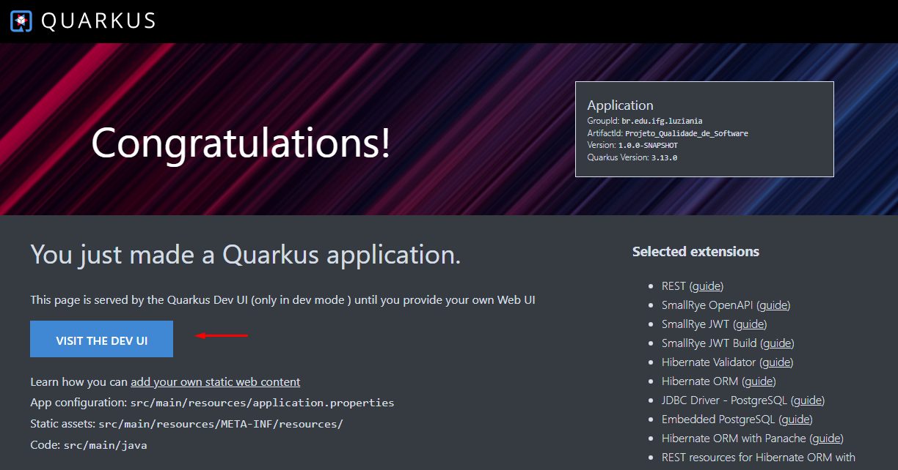

2. Ao selecionar o terceiro icone, você terá acesso aos Endpoints. Para criar um perfil de Admin, 
você deve acessar o Endpoint `/usuario/cadastroAdmin`.

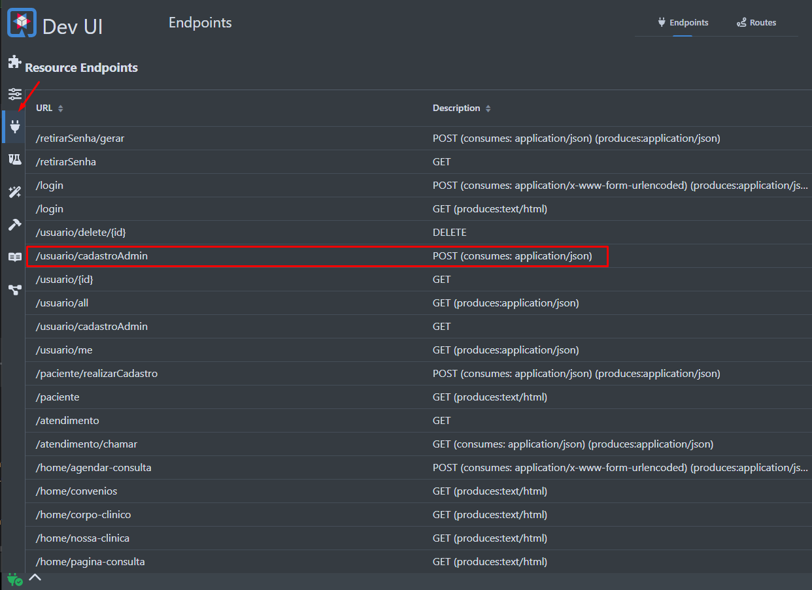

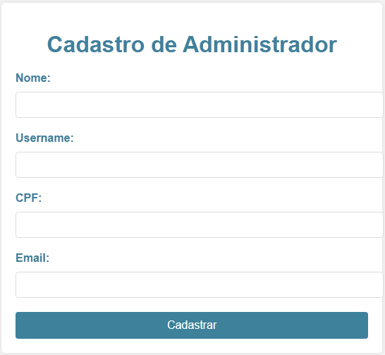

**Credenciais:**
* Usuário: Definido pelo próprio usuário no momento do cadastro

* Senha: admin123 (senha padrão; recomenda-se alterá-la após o primeiro login, acessando o menu no canto superior direito → opção "Conta")

* Perfil: admin (acesso completo ao sistema)

### 1. Tela de Login
- Aqui você irá inserir as credenciais acima informadas:

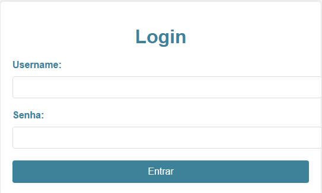

### 2. Tela Inicial
- Na tela inicial você irá encontrar um `Menu` do lado esquerdo e um dropdown com o nome do usuário que estiver logado.

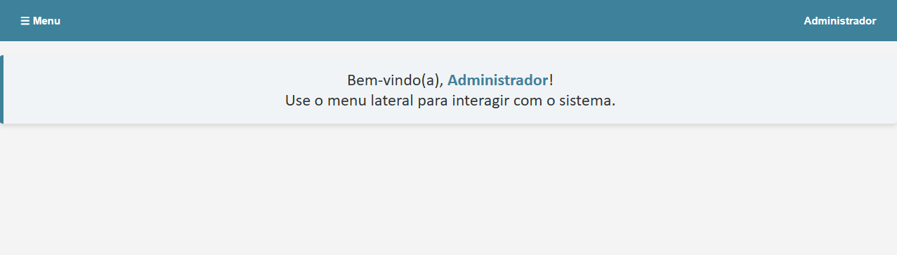

### 3. Gerar Senha

* Esta é uma tela para simular um totem para Retirar uma Senha. Você pode acessá-la através do `Menu` -> `Retirar Senha`

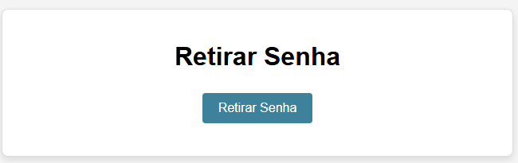

### 4. Tela de Atendimento (Recepção)

* Esta é a tela em que o atendente irá realizar o atendimento do paciente.
* Temos três opções nessa tela:

1. `Chamar Próxima Senha` que irá chamar a senha gerada no passo 3. Gerar Senha”)
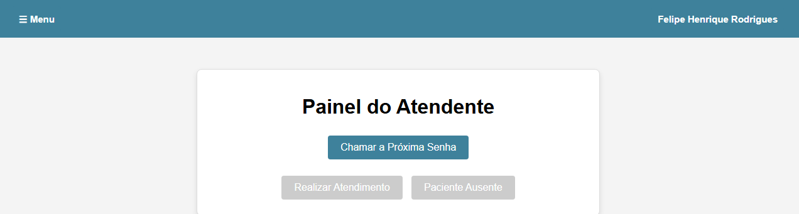

2. A opção `Realizar Atendimento` é liberada após uma senha ser chamada.

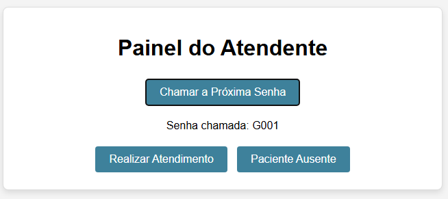

3. Na opção `Realizar Atendimento` você irá cadastrar o paciente na fila de médico.

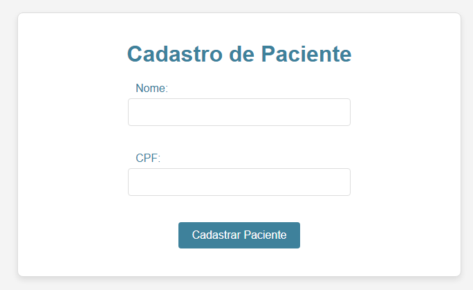

4. Continuando o fluxo do atendimento, acessando `Menu` -> `Atendimento Médico`, o médico poderá fazer a chamada do
paciente e realizar o atendimento.

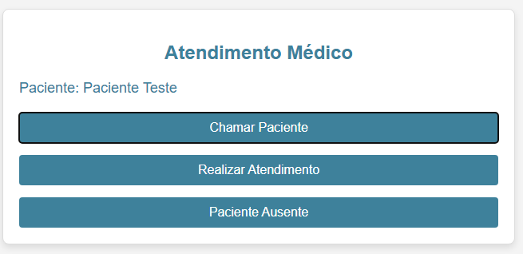

5. Ao clicar em `Realizar Atendimento`, o médico poderá gerar um Laudo Médico para o paciente.

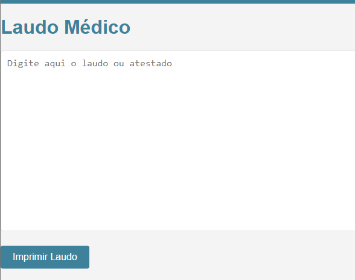

### Tela de Conta
Nessa interface, o usuário pode alterar os próprios dados cadastrais como: `Nome` e `senha`.

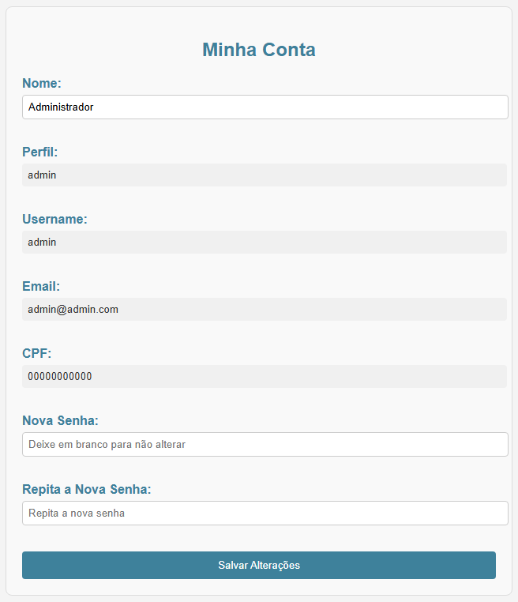


